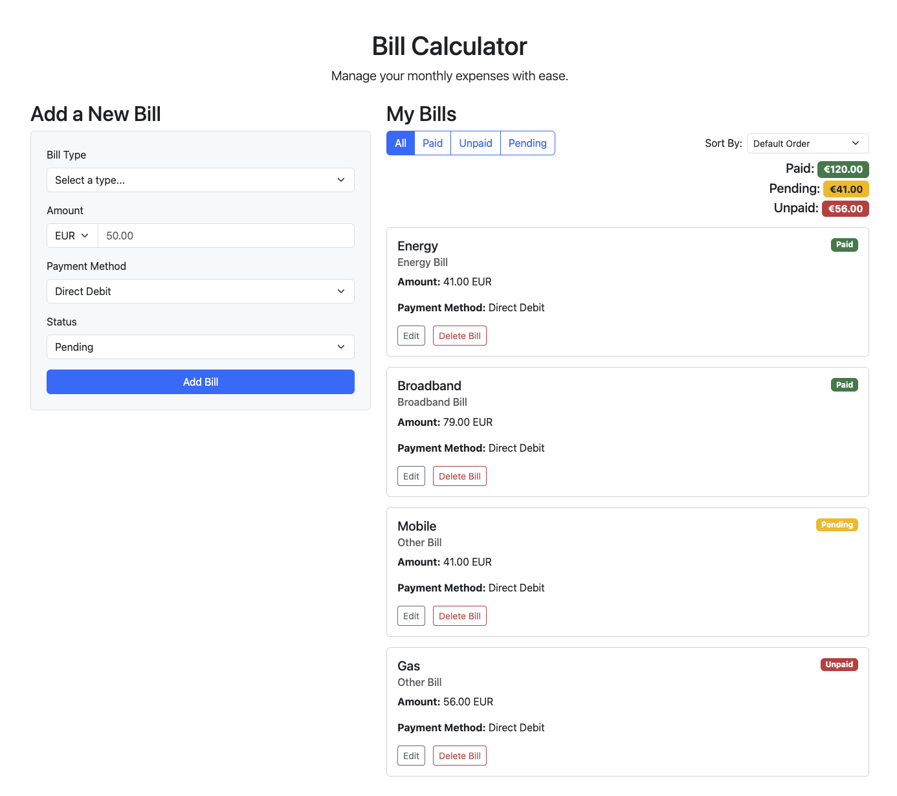

# Bill Calculator Pro

An intuitive and responsive single-page application designed to help users easily manage, track, and calculate their monthly bills in a visually organized way. This project demonstrates modern JavaScript principles, including state management, dynamic UI updates, and local data persistence.

## Live Demo

*[Link to be added later]*

## Screenshot



## Features

- **Full CRUD Functionality:**
  - **Create:** Add new bills with details like type, amount, currency, payment method, and status.
  - **Read:** View all bills in a clean, card-based layout.
  - **Update:** Edit existing bills in a pop-up modal.
  - **Delete:** Remove bills from the list.
- **Persistent Data:** The application uses the browser's `localStorage` to save all bills, so your data is waiting for you when you return.
- **Dynamic Filtering:** Filter bills by their status (All, Paid, Unpaid, Pending) with an interactive button group.
- **Data Sorting:** Sort the displayed bills by amount (high to low, low to high) or name (A-Z).
- **Responsive UI:** The layout is fully responsive and works on desktop and mobile devices, built with Bootstrap 5.
- **Conditional Form Fields:** The user interface intelligently shows or hides specific input fields based on the user's selections (e.g., for "Streaming" or "Other" bill types).

## Technologies Used

- **HTML5:** Semantic markup for the application structure.
- **CSS3:** Custom styling and layout enhancements.
- **JavaScript (ES6+):** Core application logic, including DOM manipulation, event handling, and modern features like Modules, Arrow Functions, `let/const`, Destructuring, and advanced array methods (`map`, `filter`, `reduce`, `sort`).
- **Bootstrap 5:** For the responsive grid system and pre-styled UI components (forms, buttons, cards, modals).
- **Web Storage API (`localStorage`):** To provide persistent data storage on the client-side, ensuring data is not lost on page refresh.
- **Git & GitHub:** For version control and source code management.
- **GitHub Codespaces:** For the cloud-based development environment.

## Setup and Installation

To get a local copy up and running, follow these simple steps.

### Prerequisites

You need to have Node.js and npm installed on your machine. You can download them from [nodejs.org](https://nodejs.org/).

### Installation

1.  **Clone the repo**
    ```sh
    git clone [https://github.com/your-username/your-repository-name.git](https://github.com/your-username/your-repository-name.git)
    ```
2.  **Navigate to the project directory**
    ```sh
    cd your-repository-name
    ```
3.  **Install NPM packages** (this will install `live-server`)
    ```sh
    npm install
    ```
4.  **Run the application**
    ```sh
    npm start
    ```
    This will open the application in your default browser.